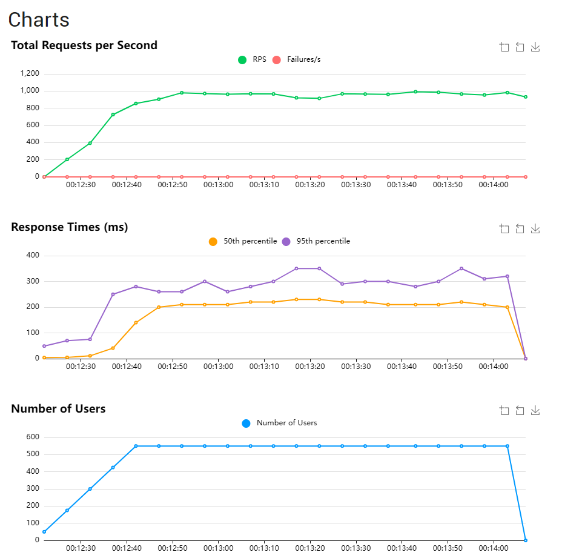

# EventPulse

**Высоконагруженная платформа приёма событий и алертинга в реальном времени**

EventPulse — это production-ready event-driven система для обработки событий с поддержкой multi-tenant архитектуры, Redis Streams, PostgreSQL и Telegram-алертинга.

[](https://python.org)
[](https://fastapi.tiangolo.com)
[](https://redis.io)
[](https://postgresql.org)
[](https://docker.com)
[](#производительность)

---

## О проекте

**EventPulse** — распределённая система обработки событий в реальном времени.  
Система принимает события через HTTP API, асинхронно обрабатывает их и выполняет сохранение, анализ метрик, проверку правил и отправку уведомлений в Telegram.

---

## Технологический стек

### Backend
- **Python 3.12**
- **FastAPI** — основной веб-фреймворк
- **Uvicorn + uvloop** — ASGI-сервер с максимальной производительностью
- **SQLAlchemy 2.0 + asyncpg** — работа с базой данных

### Базы данных и хранилища
- **PostgreSQL 16** (с TimeScaleDB для метрик)
- **Redis Streams** — основная очередь событий
- **Redis** — кэширование, rate limiting, pub/sub

### Архитектура и инструменты
- **Clean Architecture** + Dependency Injection
- **Pydantic** — валидация и сериализация
- **aiogram** — Telegram-бот
- **Docker Compose** — контейнеризация

### Тестирование и мониторинг
- **pytest** — unit + integration тесты
- **Locust** — нагрузочное тестирование

### DevOps
- **Docker**
- GitHub Actions (CI/CD)

---

## Архитектура системы

### Основной поток данных

```text
Client → FastAPI (ingest) → Auth + Rate Limit + Validation → Redis Streams → Consumer → 
Metrics + Alert Engine → PostgreSQL (batch) + Telegram
```

### Ключевые архитектурные решения

**1. Decoupled Ingestion через Redis Streams**  
API не пишет напрямую в базу. Он только добавляет событие в Redis Stream (`XADD`). Дальше обработка идёт асинхронно через consumer.  
**Преимущество**: база данных вынесена из критического пути → максимальная пропускная способность и устойчивость к нагрузке.

**2. Lua Rate Limiting**  
Ограничение запросов реализовано через атомарные Lua-скрипты в Redis.  
**Преимущество**: защита от race conditions, один round-trip, высокая производительность.

**3. Трёхуровневый кэш tenant metadata**  
- In-memory (самый быстрый)  
- Redis (shared между инстансами)  
- PostgreSQL (source of truth)  

**Результат**: почти нулевая нагрузка на БД при разрешении tenant'а.

**4. Batch writes + Consumer Group**  
Consumer читает поток, агрегирует события и делает batch-записи в PostgreSQL.  
**Классический high-load паттерн**.

**5. DLQ + Retry mechanism**  
При ошибках обработки — до 3 попыток, затем событие попадает в Dead Letter Queue.  
**Гарантия**: нет silent data loss.

---

## Структура проекта (Clean Architecture)

- `app/api/` — HTTP-эндпоинты (ingest, metrics, alerts)
- `app/core/` — auth, rate limiting, Redis, Database
- `app/models/` — SQLAlchemy модели
- `app/repositories/` — работа с БД
- `app/schemas/` — Pydantic модели
- `app/services/` — бизнес-логика (consumer, metrics, alert_checker, telegram)
- `app/bot/` — Telegram-бот для привязки аккаунтов
- `consumer.py` — основной consumer Redis Streams (чтение, обработка, batch-запись)
- `app/main.py` — точка входа приложения

---

## Telegram Alerting

Каждый пользователь самостоятельно привязывает свой Telegram-аккаунт:

```bash
/link <api_key>
/status
```

Алерты отправляются строго в привязанный чат конкретного tenant'а.  
Поддерживаются алерты по:
- росту RPS/latency
- ошибкам
- переполнению очередей
- сбоям consumer'ов и др.

---

## Возможности

- 900+ RPS ingestion
- Полностью асинхронный пайплайн
- Multi-tenant архитектура
- Lua rate limiting
- Batch-записи в PostgreSQL
- Гибкая система алертов
- Self-service привязка Telegram
- E2E и нагрузочное тестирование

---

## Быстрый старт

```bash
docker compose up -d
```

---

## Тестирование и производительность

```bash
# Тесты
pytest

# Нагрузочное тестирование
locust -f test_load.py --headless -u 550 -r 25 --host http://localhost:8000
```

**Результаты нагрузки:**
- **96 493** запроса
- **0** ошибок
- Средний RPS: **~900**
- Peak RPS: **992**
- P95: **310 ms**
- P99: **410 ms**



---

## Безопасность

- Хэширование API keys
- Изоляция tenant'ов на уровне БД
- Запрет cross-tenant доступа
- Привязка Telegram только через валидный ключ

---

## Планы развития

- Prometheus + Grafana дашборды
- Kubernetes deployment
- Расширенная аналитика

---

## Лицензия

MIT

---

<div align="center">
  <strong>EventPulse</strong><br>
  <em>Event-driven multi-tenant платформа с Telegram-алертингом</em><br><br>
  900+ RPS • Redis Streams • AsyncIO • Production-ready
</div>
